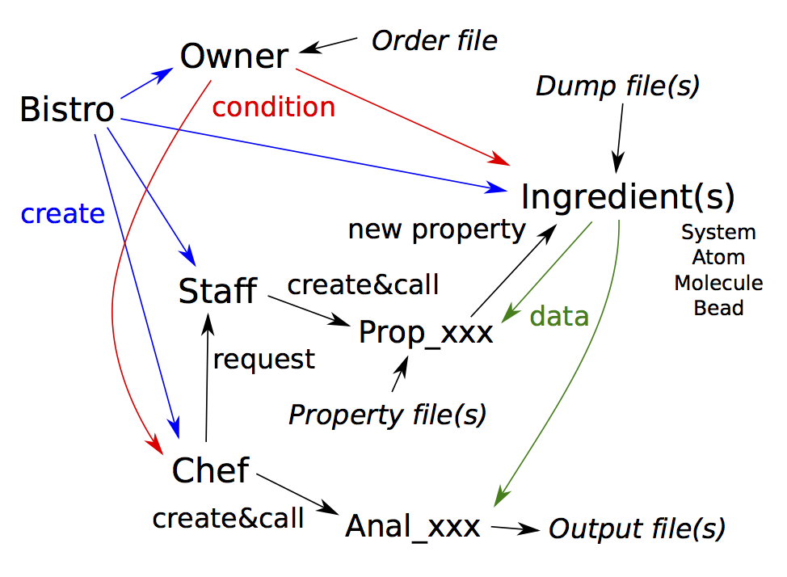

# LammpsAnalysis-cpp

## プログラムの構造



### main.cpp

* クラス「Bistro」を生成する．

### bistro.h & bistro.cpp

* 一連の解析操作の場を提供する：クラス「Owner, Chef, Staff, Ingredient」のインスタンスを生成する．
* 出力ディレクトリの名前 *outdir* ，プロパティディレクトリの名前 *propdir* を保持している．
* Dumpファイルの数として *numitrs* を保持している．

### owner.h & owner.cpp

* 解析条件ファイル（Orderファイル）を読み込んで各種の設定を行う．
* 関数 *get_names_order()* : Orderファイル内の解析名配列を取得する．
* 関数 *get_order(解析名)* : Orderファイル内の解析条件文を取得する．

### chef.h & chef.cpp

* 解析クラス「Anal_xxx」のインスタンス生成と管理を行う．
* 関数 *cook(クラス「Ingredient」へのポインタ)* : 各時刻における処理を行う関数を各解析クラスから呼び出す．
* 関数 *serve()* : 各時刻の処理結果のトラジェクトリを解析し，その結果を出力する関数を各解析クラスから呼び出す．

### staff.h & staff.cpp

* プロパティ計算クラス「Prop_xxx」のインスタンス生成と管理を行う．
* 関数 *precook(クラス「Ingredient」へのポインタ)* : 各時刻におけるプロパティを計算する関数を各プロパティ計算クラスから呼び出す．

### ingredient.h & ingredient.cpp

* Dumpファイルを読み込み，データクラス「System, Atom, Molecule, Bead」のインスタンス生成，及びそれらの基本データの計算を行う．
* 関数 *get_index()* : Dumpファイルのインデックスを取得する．
* 関数 *get_system()* : Systemクラスのインスタンスへのポインタを取得する．
* 関数 *get_atoms()* : Atomクラスのインスタンスへのポインタ配列を取得する．
* 関数 *get_beads()* : Beadクラスのインスタンスへのポインタ配列を取得する．
* 関数 *get_mols()* : Moleculeクラスのインスタンスへのポインタ配列を取得する．
* 関数 *get_allatoms()* : 分子タイプをゼロにして解析から除外した原子も含め，全てのAtomクラスのインスタンスへのポインタ配列を取得する．
* クラス「Atom, Bead, Molecule」はクラス「Particle」を継承しているため，以下ではまとめて粒子系クラス *or* 粒子クラスとも書く．

### anal_\*.h & anal_\*.cpp

* 各種の解析を行うクラス．**追加可能**

### prop_\*.h & anal_\*.cpp

* 各種のプロパティを計算するクラス．**追加可能**

### analysisbase.h

* 解析クラスの基本クラス「AnalysisBase」用のヘッダ．新しく解析クラスを作成するときはこれを継承する．
* 粒子系クラスを実数プロパティの範囲，もしくは整数プロパティの範囲で選別するためのメンバをもつ．
* 関数 *add_range(実数プロパティの範囲式)* : Orderファイルの解析条件部分で "Range" の右側の文字列から実数プロパティの範囲を設定する．
* 関数 *add_list(整数プロパティのリスト)* : Orderファイルの解析条件部分で "List" の右側の文字列から整数プロパティのリストを設定する．
* 関数 *extract(粒子系クラスのポインタ)* : 受け取った粒子系クラスのインスタンスのうち，その実数プロパティが解析条件として設定した全ての範囲に含まれ，かつ整数プロパティが解析条件として設定した全てのリストに含まれるものへのポインタ配列を返す．

### pointers.h

* クラス「Pointers」用のヘッダ．このクラスを継承することで，クラス「Bistro」のインスタンス及びそれが生成したインスタンスへのポインタを使うことができる．

### utility.h

* 便利で汎用性の高い関数を書いておくヘッダ．

## コンパイルと実行

コンパイルはMakefileでできます．コンパイラとオプションは適宜変更してください．ただし，OpenMPによる並列化とC++11の文法が使われているため，```-fopenmp -std=c++11```のオプションは必須です．

実行文は以下のようになります．
```
./analmp -in Orderファイル名 -prop プロパティフォルダ名 -out 出力ディレクトリ名
```
例)
```
/analmp -in order00 -prop prop00 -out dir007
```

## 基本データについて

クラス「Ingredient」がもつデータクラスについて，それぞれのデータクラスのメンバは以下のとおり．基本的に，下記のメンバを使って解析を行う．<Font color=red>とくに，```std::map<std::string,int(double)>``` により，文字列から<b>整数（実数）プロパティ</b>へのアクセスが可能（整数・実数のスカラ値のみ，基本データを含む）で，これが解析の要となります．</font>

### Data

* 各データクラスの基本クラス．
* *dprop["プロパティ名"]* で実数プロパティにアクセスできる．
* *iprop["プロパティ名"]* で整数プロパティにアクセスできる．

### System

* クラス「Data」を継承している．
* *timestep* : 時間ステップ．
* *numatoms* : 原子数．
* *numbeads* : ビーズ数．
* *nummols* : 分子数．
* *periodic["x"], periodic["y"], periodic["z"]* : 周期境界条件であれば *"pp"* となる．
* *boxmin* : 計算系の最小点位置ベクトル．
* *boxmax* : 計算系の最大点位置ベクトル．
* *boxlen* : 計算系の辺の長さを各成分にもつベクトル．

### Particle

* クラス「Data」を継承している．位置と速度はベクトルとして頻繁に使用されるため，プロパティとは別に宣言した．プロパティとしてもアクセス可能．
* *pos* : 位置ベクトル．*dprop["xu"], dprop["yu"], dprop["zu"]* で各成分にアクセスすることも可能．
* *vel* : 速度ベクトル．*dprop["vx"], dprop["vy"], dprop["vz"]* で各成分にアクセスすることも可能．
* *wpos* : オリジナルセル内に畳み込んだときの位置ベクトル．*dprop["wx"], dprop["wy"], dprop["wz"]* で各成分にアクセスすることも可能．
* *mass* : 質量．*dprop["mass"]* でアクセスすることも可能．

### Atom

* クラス「Particle」を継承している．原子の数だけインスタンスが生成される．
* 原子のID，タイプ，属している分子ID，属しているビーズIDにはそれぞれ *iprop["id"], iprop["type"], iprop["mol"], iprop["bead"]* でアクセスできる．2個のビーズにまたがって属している場合は *iprop["bead1"], iprop["bead2"]* でビーズIDにアクセスすることになるので注意．

### Bead

* クラス「Particle」を継承している．ビーズの数だけインスタンスが生成される．
* *members* はビーズ内原子へのポインタ配列．
* *weights* は粗視化の際のビーズ内原子の重み．
* ビーズのID，タイプ，属している分子IDにはそれぞれ *iprop["id"], iprop["type"], iprop["mol"]* でアクセスできる．

### Molecule

* クラス「Particle」を継承している．分子の数だけインスタンスが生成される．
* *memberatoms* は分子内原子へのポインタ配列．
* *memberbeads* は分子内ビーズへのポインタ配列．
* 分子のID，タイプにはそれぞれ *iprop["id"], iprop["type"]* でアクセスできる．

## オーダーについて

Orderファイルに設定条件を書きます．

各セクションのはじめは以下のように書きます．```$```のあとの半角スペースは必須です．
```
$ セクション名
#のあとはコメントアウト
```
サンプルファイルも参考にしてください．

### Classicセクション

ビーズを対象とした解析を行うためには必須です．分子を対象にした解析の場合，Dumpファイルに分子IDが含まれていれば特に必要ありません．原子IDが連続する同種分子をグループ化し，タイプ・分子数・最小原子ID・最大原子IDを書きます．

### Atomセクション

必須です．原子タイプとその質量を書きます．質量以外の実数プロパティも追加可能です．はじめの行にプロパティ名を書きます．**原子タイプは1から順に書く必要があります**．

### Moleculeセクション

任意．分子タイプごとに追加したい実数プロパティがあればAtomセクションと同じように書いてください．

### Beadセクション

任意．ビーズタイプごとに追加したい実数プロパティがあればAtomセクションと同じように書いてください．

### DumpFileセクション

必須．Dumpファイルの数，初期時間ステップ，時間ステップ間隔，ファイル接頭・接尾字，整数のプロパティ名を書きます．**Dumpファイルの ```ITEM: ATOMS``` 行に書いてある文字列がそのままプロパティ名として読み込まれます**

### CoarseGrainingセクション

ビーズを対象とした解析を行うためには必須です．分子タイプとそれに対応した粗視化マッピングのファイル名を書きます．

**[Mappingファイル]**

空行がないように書きます．サンプルファイルも参考にしてください．
* ```ID : Type``` 以下にビーズの相対ID（分子内の先頭IDを1とする）とそのタイプを書いていきます．
* ```ID : Members``` 以下にビーズの相対IDとそのビーズに含まれる原子の相対IDを書いていきます．
* ```ID : Weights``` 以下にビーズの相対IDとそのビーズに含まれる原子の重みを書いていきます．この部分は任意で，なければすべての重みは 1 に設定されます．

### 解析セクション

```$ 解析名``` と書くことにより，その名前が指す解析が行われます．セクション内に書くべきことは解析によりますが，クラス「AnalysisBase」を継承した解析クラスであれば，```Range```と```List```により，それぞれ実数プロパティの範囲と整数プロパティのリストにもとづいて粒子系クラスの解析対象を絞り込めます．

**[プロパティによる絞り込み]**

<u>*実数プロパティの範囲による絞り込み*
```
Range 最小値 <= プロパティ名 <= 最大値
```
最大値には```inf```，最小値には```-inf```が使えます．

例えば，x 方向の速度が 0.1 [unit velocity] 以下の粒子のみを対象として解析を行いたければ，その解析セクションに以下の行を加えます．
```
Range -inf <= vx <= 0.1
```
条件は重ねることができるので，さらに z 座標が 5 [unit length] 以上かつ 10 [unit length] 以下の粒子に絞り込みたければ，以下のように書きます．
```
Range -inf <= vx <= 0.1
List 5 <= zu <= 10
```

<u>*整数プロパティのリストによる絞り込み*
```
Range プロパティ名 プロパティ ...
```
例えば，タイプが 1 と 4 の粒子のみを対象として解析を行いたければ，その解析セクションに以下の行を加えます．
```
List type 1 4
```
整数プロパティのリストの条件も重ねることができます．さらに，実数プロパティと整数プロパティの条件を重ねることもできます．**重ねた条件を全て満たす粒子が解析対象になります**

## プロパティについて

基本データ以外のプロパティを追加する方法が 3 通りあります．
* 一つ目はオーダファイルに粒子タイプごとの実数プロパティを書く方法です．
* 二つ目はプロパティフォルダ内のファイルから粒子IDごとのプロパティを読み込む方法です．名前が「xxx」のプロパティを与えたい場合，実数であればファイル名を *double_xxx*，整数であればファイル名を *int_xxx* とします．ファイルの内容は 1 行目に粒子のタイプ，すなわち，*atom, molecule, bead* のいずれかを書き，それ以降にプロパティ値を書いていきます．したがって，i+1 行目に ID = i の粒子のプロパティを書くことになります．ファイルの数に制限はありませんが，一つのファイルに書けるプロパティは一種類だけです．これらの処理は *prop_integer.h, prop_integer.cpp, prop_double.h, prop_integer.cpp* が行います．
* 三つ目はプロパティ計算クラスをつくる方法です．

**[プロパティ名の一覧]**

新しいプロパティを追加するときは同列内の重複がないようにすること．

| プロパティ計算名 | System int | System double | Atom int | Atom double | Bead int | Bead double | Molecule int | Molecule double |
|:-:|:-:|:-:|:-:|:-:|:-:|:-:|:-:|:-:|
| - (Basic Data) | - | - | id,type,mol,bead(bead1,bead2) | xu,yu,zu,vx,vy,vz,wx,wy,wz,mass | id,type,mol | xu,yu,zu,vx,vy,vz,wx,wy,wz,mass | id,type | xu,yu,zu,vx,vy,vz,wx,wy,wz,mass |
| InertiaMoment | - | - | - | - | - | - | - | Ixx,Iyy,Izz,Ixy,Iyz,Izx |
| GyrationRadius | - | - | - | - | - | - | - | Rgxyz^2,Rgx^2,Ryg^2,Rgz^2,Rgxy^2,Rgyz^2,Rgzx^2 |
| Orientation | - | - | - | - | - | - | - | Sx_max,Sy_max,Sz_max,Sx_min,Sy_min,Sz_min |
| SystemDrift | - | CoMx,CoMy,CoMz | - | - | - | - | - | - |

こんな感じにアクセスできます．
```
atom->iprop["type"];
mol->dprop["Rgxyz^2"];
```

## 解析クラスの追加

1. 新しい解析のプログラムとヘッダを作成します．
2. *chef.h* にクラスへのポインタの宣言を，*chef.cpp* にコンストラクタ（と必要なプロパティのリクエスト）・各時刻での処理・解析と出力の関数を呼び出す部分を追加します．解析名が「YourAnalysis」の場合に追加すべき文がコメントアウトで書いてあるので参考にしてください．

### 1.について

* ヘッダに書かなければならないもの
  * 解析に必要なプロパティ計算名の配列 *property_request*
  * コンストラクタの宣言
  * 各時刻での処理をする関数の宣言 *analysis_instant(class Ingredient \*)*
  * 解析・出力関数の宣言 *analysis_trajectory()*
  * 必要なプロパティ計算名の配列を返す関数 *get_property_request()*
* ヘッダに書いたほうがよいもの
  * Orderファイルの解析セクションから読み込むパラメータ：コンストラクタで読み込み，その他の関数で使うため
  * *std::vector型* のトラジェクトリ配列（各要素が各時刻に処理したデータ）：各時刻のDumpファイルは並列処理されるため，各時刻ごとの処理結果を個別に保管できるコンテナを用意しておくと良い．時間平均しか得られないプログラムにしてしまうと，あとで時間変化を解析結果として取得したいときに困る．
* コンストラクタに書くもの
  * Orderファイルの解析セクションを読み込み，パラメータ設定を行う部分．とりあえずは必要なくても```Range```と```List```の行も書いてください．
  * トラジェクトリ配列のサイズ設定．
* 関数 *analysis_instant* に書くもの
  * クラス「Ingredient」から必要なデータクラスのポインタを取得する部分．関数 *extract* を使うことで，プロパティによる絞り込みが可能．また，解析対象が *atom, molecule, bead* から選べる場合は，クラス「Particle」へアップキャストすることで，汎用的なプログラムを書くことが可能．
  * 現時刻のデータ処理とその結果をトラジェクトリに追加する部分．
* 関数 *analysis_trajectory* に書くもの
  * トラジェクトリ配列から平均などの統計量を計算する部分．
  * 出力ファイルの作成と解析結果の出力．

## プロパティ計算クラスの追加

プロパティ名とプロパティ計算名は違います．プロパティ計算は基本データ以外のプロパティを追加するための第三の方法です．

1. 新しいプロパティ計算のプログラムとヘッダを作成します．
2. *staff.h* にクラスへのポインタの宣言を，*staff.cpp* にコンストラクタ（と必要なプロパティのリクエスト）と各時刻でのプロパティ計算をする関数を呼び出す部分を追加します．プロパティ計算名が「YourProperty」の場合に追加すべき文がコメントアウトで書いてあるので参考にしてください．プロパティ間の依存関係に注意して記述する順番を決めてください．

### 1.について

* ヘッダに書かなければならないもの
  * 解析に必要なプロパティ計算名の配列 *property_request* （あるプロパティ計算において，それより前に計算されたプロパティを使用可能）
  * コンストラクタ
  * 各時刻でのプロパティの計算を行う関数 *calculate_property(class Ingredient \*)*
  * 必要なプロパティ計算名の配列を返す関数 *get_property_request()*
* 関数 *calculate_property* に書くもの
  * クラス「Ingredient」から必要なデータクラスのポインタを取得する部分．
  * データからプロパティを計算する部分．

## 各解析について

### 全原子MDの結果を粗視化してLammpsのDumpファイル形式で出力

* 解析名：BeadDump
* パラメータ：なし
* ビーズを対象にした解析になります．

### 分子の回転半径の平均値・分子ごとの時間変化を出力

* 解析名：GyrationRadius
* パラメータ：
  * Dimension: [xyz] 回転半径が求まります [x,y,z,xy,yx,zx] 文字に対応する次元の成分だけで回転半径と同じ計算をした結果が得られます．
* 分子を対象にした解析になります．

### 平均二乗変位と分子ごとの二乗変位を出力

* 解析名：MeanSquareDisplacement
* パラメータ：
  * Dimension: [x+y+z] 3次元の平均二乗変位が求まります．文字を減らせば2次元，1次元の平均二乗変位も計算できます．
  * Target: 原子，ビーズ，分子のうちから選択します．
  * Number_of_Samples: 初期時刻をこの数だけとってサンプリングします．例えば，データが 100 ステップ分ある場合にこの数を 10 に設定すると，初期時刻を 1 ~ 10 ステップにしてサンプリング数をかせぎ，長さ 90 ステップ分の平均二乗変位が得られます．

### 数密度分布を出力

* 解析名：NumberDensityDistribution
* パラメータ：
  * Direction: [x,y,z] どの方向の分布を計算するのか選びます．
  * Target: 原子，ビーズ，分子のうちから選択します．
  * Number_of_Bins: Binの数．
  * Original: 分布方向の原点位置．
  * Bin_Width: Binの幅．シミュレーションの単位長さで書く．

### 分子配向の平均値・分子ごとの時間変化を出力

* 解析名：Orientation
* パラメータ：
  * Direction: [x_min,y_min,z_min] 指定した方向の配向度パラメータが得られます． [x_max,y_max,z_max] 配向度パラメータは分子の長軸（慣性モーメントが最小になる主軸）方向で計算しますが，この場合は短軸方向で同様の計算をした結果が得られます．
* 分子を対象にした解析になります．

### プロパティ計算を要求

* 解析名：PropertyRequest
* パラメータ：プロパティ計算名を書くと，そのプロパティが必要な解析が無い場合でも計算されるようになります．プロパティによる解析対象の絞り込みに使えます．

### 動径分布関数を出力

* 解析名：RadialDistributionFunction
* パラメータ：
  * Target: 原子，ビーズ，分子のうちから選択します．
  * Number_of_Bins: Binの数．
  * Bin_Width: Binの幅．シミュレーションの単位長さで書く．

## 各プロパティ計算について

### 分子の慣性モーメントを計算

* プロパティ計算名：InertiaMoment
* 各分子に対し，以下の名前の実数プロパティが計算されます．
  * Ixx, Iyy, Izz: 慣性モーメントテンソルの対角成分
  * Ixy, Iyz, Izx: 慣性モーメントテンソルの非対角成分

### 分子の回転半径を計算

* プロパティ計算名：GyrationRadius
* 各分子に対し，以下の名前の実数プロパティが計算されます．
  * Rgxyz^2: 回転半径の二乗
  * Rgx^2, Rgy^2, Rgz^2,: 一成分のみで計算した回転半径の二乗
  * Rgxy^2, Rgyz^2, Rgzx^2,: 二成分のみで計算した回転半径の二乗

### 分子配向を計算

* プロパティ計算名：Orientation
* 各分子に対し，以下の名前の実数プロパティが計算されます．
  * Sx_min, Sy_min, Sz_min: 慣性モーメントが最小になる主軸方向で計算した配向パラメータ．
  * Sx_max, Sy_max, Sz_max: 慣性モーメントが最大になる主軸方向で計算した配向パラメータ．

### 計算系の質量中心を計算

* プロパティ計算名：SystemDrift
* 計算系に対し，以下の名前の実数プロパティが計算されます．
  * CoMx, CoMy, CoMz: 位置ベクトルの各成分．

## Eigen

* 線形代数的な処理ができるライブラリ．「Eigen」フォルダをインクルードディレクトリに置いて使う． **[HomePage](http://eigen.tuxfamily.org/index.php?title=Main_Page)**
* アップデートする場合は *DenseCoeffsBase.h* に以下を追加すること．
```
EIGEN_DEVICE_FUNC
EIGEN_STRONG_INLINE CoeffReturnType
operator[](const std::string &str) const
{
  Index index;
  if (str == "x") { index = 0; }
  else if (str == "y") { index = 1; }
  else if (str == "z") { index = 2; }
  else { exit(1); }
  EIGEN_STATIC_ASSERT(Derived::IsVectorAtCompileTime,
                      THE_BRACKET_OPERATOR_IS_ONLY_FOR_VECTORS__USE_THE_PARENTHESIS_OPERATOR_INSTEAD)
  eigen_assert(index >= 0 && index < size());
  return coeff(index);
}
```
```
EIGEN_DEVICE_FUNC
EIGEN_STRONG_INLINE Scalar&
operator[](const std::string &str)
{
  Index index;
  if (str == "x") { index = 0; }
  else if (str == "y") { index = 1; }
  else if (str == "z") { index = 2; }
  else { exit(1); }
  EIGEN_STATIC_ASSERT(Derived::IsVectorAtCompileTime,
                      THE_BRACKET_OPERATOR_IS_ONLY_FOR_VECTORS__USE_THE_PARENTHESIS_OPERATOR_INSTEAD)
  eigen_assert(index >= 0 && index < size());
  return coeffRef(index);
}
```
以上の行を追加することによりVector3d型の変数 v に対して，```v[0], v[1], v[2]```の代わりにそれぞれ```v["x"], v["y"], v["z"]```とも書けるようになる．

## ToDo

Dimension と Direction の複数指定
